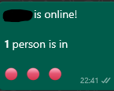
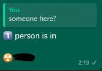

# Malshan

This project was created to allow a group of friends to always know who is online and who is getting online, so they won't have to worry about inviting each other and wait.

A combination of a Discord bot and a WhatsApp bot, to notify Whatsapp group chat members when someone joins a Discord voice channel, and also allow users to ask who is connected and be replied with the list of users in the voice channel.

## Setup

1. Install dependencies and build

```
npm install
npm run build
```

2. Copy the `.env.example` file located in the root folder, to a `.env` file, remove all comments and fill the variables with your own data. [Explained here](#Environment-Variables).

3. Copy the `.ignoredUsers.json.example` file located in the `data` folder to a `.ignoredUsers.json` file, add the users you want to ignore in the list (can be left empty). This is relevant for music bots and similar Discord users you don't want to receive messages for.

4. Start the application and head to the http endpoint (http:localhost:<serverPort>) to see the status.

```
npm start
```

5. If it's the first time you start the application, a qr code will be shown, scan it using the WhatsApp application on your phone to allow access to the bot.

6. After that the message on the screen should be OK, and you will be able to use the bot. (Websocket is planned, but currently manual refresh is required to see the updated screen)

## Screenshots

### When someone joins the Discord voice channel



### When someone asks if someone is here



## Environment Variables

There is a description for every variable in the `.env.example` file, but some variables are not straightforward.

1. `DISCORD_BOT_TOKEN` and `DISCORD_APPLICATION_ID`:  
   In order to get these values you will have to create a new application in the [discord developer portal](https://discord.com/developers/applications).  
   The application ID will be in the 'General Information' tab.  
   The bot token is available in the `Bot` tab.  
   Don't forget to invite your bot to your Discord server.
2. `DISCORD_SERVER_ID`and `DISCORD_AFK_CHANNEL_ID`:
   In order to get these values you will have to set `DISCORD_IS_LOG_SERVER_ID` and `DISCORD_IS_LOG_CHANNEL_ID` to `true`.  
   Then run the application and join a voice channel in a Discord server your bot is already in.  
   The server id and the channel id should be printed.
3. `WHATSAPP_CHAT_ID`:  
   In order to get this value you will have to set `WHATSAPP_IS_LOG_CHAT_ID` to `true`.  
   Then send a WhatsApp message in the group you'd like to listen to.  
   The chat id should be printed, if the same user who authenticated sent the message, the group chat id will be printed in the `chat id to` part, otherwise the chat id will be printed in the `chat id from` part.  
   Don't forget to authenticate using the QR code before trying to send messages.

#### Note: You might need to fill some variables with random string in order to run the application when trying to gather initial information.
